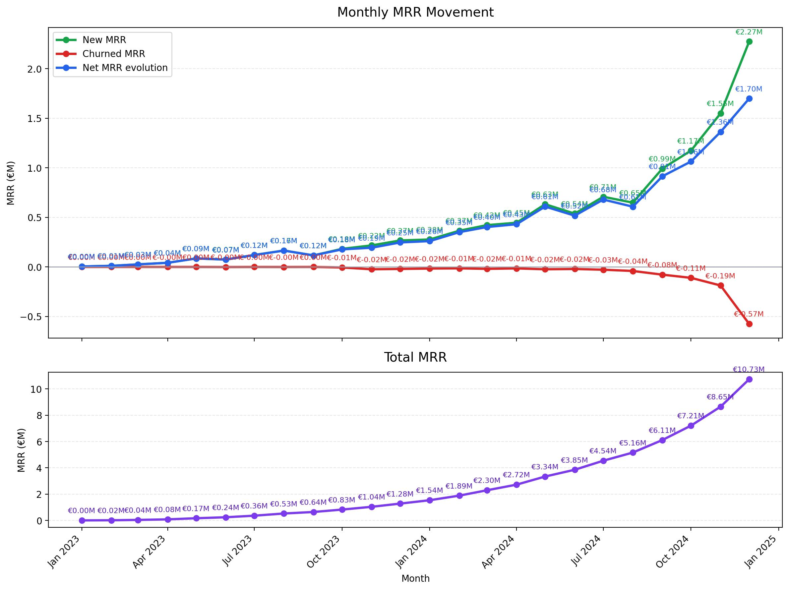
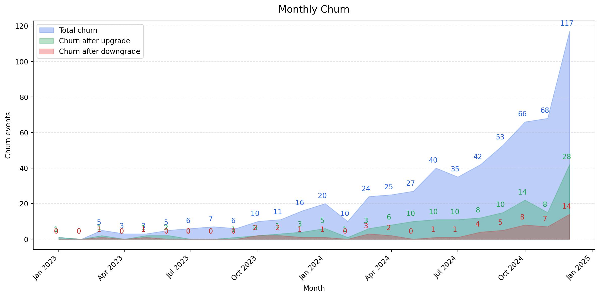

## Consigne

Dataset :
Merci d'utiliser le dataset public Kaggle "SaaS Subscription & Churn Analytics Dataset" https://www.kaggle.com/datasets/rivalytics/saas-subscription-and-churn-analytics-dataset

Contexte :
Imagine que ces données proviennent d'une entreprise SaaS. Le CEO souhaite mieux comprendre l'évolution du revenu, le churn client et l'usage produit.

Temps attendu :
Merci de ne pas passer plus de 2 à 3 heures sur l'exercice. Nous n'attendons pas un projet parfait ou prêt pour la production. Nous accordons surtout de l'importance à ton raisonnement, tes hypothèses et ta clarté.

Missions :

1. Exploration des données
   - Décris brièvement les tables disponibles.
   - Identifie les principales clés et relations entre les tables.
   - Mentionne les éventuels problèmes de qualité de données ou hypothèses nécessaires.

2. Analyse du revenu
   - Calcule l'évolution mensuelle du MRR.
   - Identifie, si possible, le nouveau MRR, le MRR perdu à cause du churn et l'évolution nette du MRR.
   - Présente le résultat sous forme de tableau et/ou de graphique.

3. Analyse du churn
   - Calcule le taux de churn par mois.
   - Identifie les segments, plans ou comptes avec un churn plus élevé.
   - Propose 2 à 3 explications business possibles.

4. Analyse de l'usage produit
   - Analyse si l'usage des fonctionnalités semble lié au churn.
   - Identifie les fonctionnalités les plus utilisées par les comptes conservés vs les comptes churnés.

5. Recommandations
   - Propose 3 à 5 KPIs à inclure dans un dashboard de pilotage SaaS.
   - Suggère une amélioration du modèle de données ou du pipeline de données.

Livrables :
- Un notebook, un fichier SQL, un script Python ou un dashboard BI.
- Un court résumé de tes conclusions.
- Merci d'inclure tes hypothèses et les limites de ton analyse.

Quand tu as terminé, envoie nous un lien vers un repo github publique contenant ta solution à bruno.degomme@leexi.ai, et prends rendez-vous pour l'entretien techniqueici https://calendly.com/bruno-degomme/30min, de préférence en après-midi.

## Résultats

### Exploration des données

#### Description des tables

Voici les tables avec leurs variables et le type de ces variables, ainsi que des commentaires sur certaines données

**ravenstack_accounts.csv**

| Colonne | Type | Notes |
|---|---:|---|
| account_id | str | Clé primaire |
| account_name | str |  |
| industry | str |  |
| country | str |  |
| signup_date | str | Pourait être une date |
| referral_source | str |  |
| plan_tier | str | Pourait être un int |
| seats | int64 |  |
| is_trial | bool |  |
| churn_flag | bool |  |

**ravenstack_churn_events.csv**

| Colonne | Type | Notes |
|---|---:|---|
| churn_event_id | str | Clé primaire |
| account_id | str |  |
| churn_date | str | Pourait être une date |
| reason_code | str |  |
| refund_amount_usd | float64 |  |
| preceding_upgrade_flag | bool |  |
| preceding_downgrade_flag | bool |  |
| is_reactivation | bool |  |
| feedback_text | str |  |

**ravenstack_feature_usage.csv**

| Colonne | Type | Notes |
|---|---:|---|
| usage_id | str | Clé primaire |
| subscription_id | str |  |
| usage_date | str | Pourait être une date |
| feature_name | str |  |
| usage_count | int64 |  |
| usage_duration_secs | int64 |  |
| error_count | int64 |  |
| is_beta_feature | bool |  |

**ravenstack_subscriptions.csv**

| Colonne | Type | Notes |
|---|---:|---|
| subscription_id | str | Clé primaire |
| account_id | str |  |
| start_date | str | Pourait être une date |
| end_date | str | Pourait être une date |
| plan_tier | str | Pourait être un int |
| seats | int64 |  |
| mrr_amount | int64 | Devrait être un float |
| arr_amount | int64 | Devrait être un float |
| is_trial | bool |  |
| upgrade_flag | bool |  |
| downgrade_flag | bool |  |
| churn_flag | bool |  |
| billing_frequency | str |  |
| auto_renew_flag | bool |  |

**ravenstack_support_tickets.csv**

| Colonne | Type | Notes |
|---|---:|---|
| ticket_id | str | Clé primaire |
| account_id | str |  |
| submitted_at | str | Pourait être une date |
| closed_at | str |Pourait être une date |
| resolution_time_hours | float64 |  |
| priority | str | Pourait être un int |
| first_response_time_minutes | int64 |  |
| satisfaction_score | float64 |  |
| escalation_flag | bool |  |

#### Analyse :

Nous avons des comptes ("accounts") pour chaque client. Ces comptes peuvent être reliés à plusieurs souscriptions ("subscriptions"). Chaqune de ces souscriptions peut avoir des fonctionnalités ("features"). Chacun des clients peut annuler son abonnement ("churn"). Ils peuvent également générer des ticket de support ("support_tickets")

Il faut s'assurer qu'il n'y est qu'une sousription active par compte. On pourrait fusioner les tables churn et subscription dans account, en gardant un historique des souscriptions/annulations et en sauvegarde l'état actuelle du compte (abonné ou pas) ce qui réduirait la taille du stockage et le temps de calcul nécessaire.

### évolution du MRR

### évolution du Churn

### Proposition de KPI

- **MMR** et **ARR**
- Ratio **Nouveau client** sur **Nombre de client**
- Ratio **Churn** sur **Nombre de client**

### évolution du modèle

On pourrait utilisé une base de donné et automatisé le dashboard en piochant dans la base.\\
Concernant la structure des données, je reviens sur ce que j'ai dis précédemment, on pourrait fusioner les tables churn et subscription dans account, en gardant un historique des souscriptions/annulations et en sauvegarde l'état actuelle du compte (abonné ou pas) ce qui réduirait la taille du stockage et le temps de calcul nécessaire.

### Limites

Le dataset ne couvre que quelques mois, on ne peut donc dégager de tendance long terme. Egalement, une analyse quotidienne serait plus précise.
